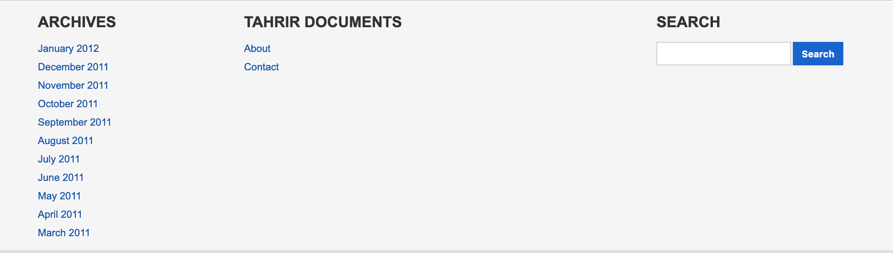
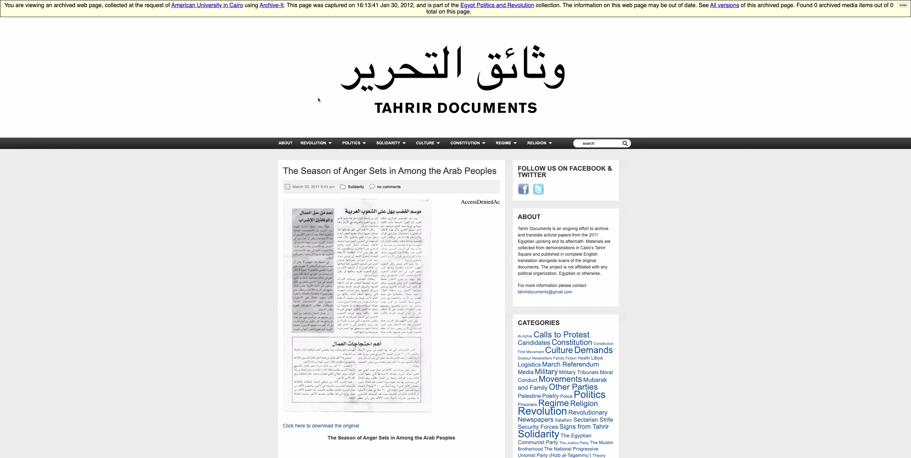
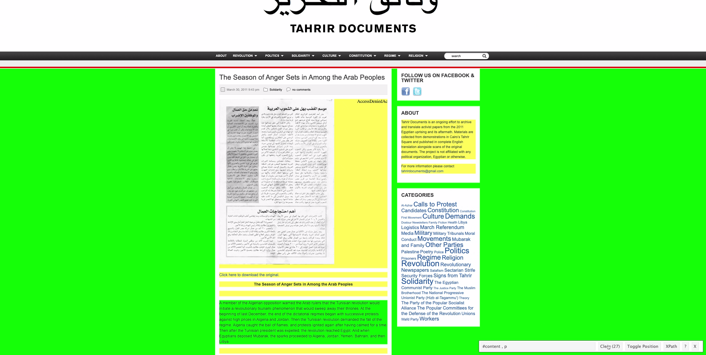
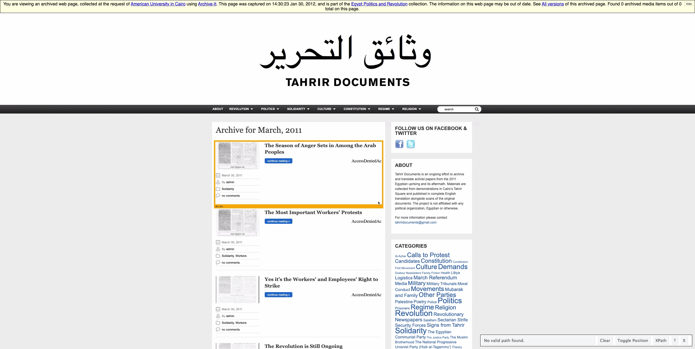

# Working with Digital Data

The lecture material for today mentioned work by @Freelon2018a, @Bruns2019, @Puschmann2019, and @Lazer2020b as well as a [report](https://www.disinfobservatory.org/download/26541) by SOMA outlining solutions for research data exchange. 

These example tasks use different sources of online data, and here I introduce you to how we might gather data through both screen-scraping (or server-side) techniques as well as API (or client-side) techniques. 

## Tutorial: Screen-scraping 

In this tutorial, you will learn how to summarise, aggregate, and analyze text in R:

* How to select elements of CSS using SelectorGadget (see [here](https://rvest.tidyverse.org/articles/articles/selectorgadget.html) for a detailed overview)
* How to use the <tt>rvest</tt> package to scrape parts of a webpage

## Setup 

To practice these skills, we will use a series of webpages on the Internet Archive that host material collected at the Arab Spring protests in Egypt in 2011. The original website can be seen [here](https://www.tahrirdocuments.org/) and below.

{width=100%}

##  Load data and packages 

Before proceeding, we'll load the remaining packages we will need for this tutorial.


```r
library(tidyverse) # loads dplyr, ggplot2, and others
library(ggthemes) # includes a set of themes to make your visualizations look nice!
library(readr) # more informative and easy way to import data
library(stringr) # to handle text elements
library(rvest) #for scraping
```

We can download the final dataset we will produce with:


```r
pamphdata <- read_csv("data/pamphlets_formatted_gsheets.csv")
```

```
## 
## ── Column specification ────────────────────────────────────────────────────────
## cols(
##   title = col_character(),
##   date = col_date(format = ""),
##   year = col_double(),
##   text = col_character(),
##   tags = col_character(),
##   imageurl = col_character(),
##   imgID = col_character(),
##   image = col_character()
## )
```

You can also view the formatted output of this scraping exercise, alongside images of the documents in question, in Google Sheets [here](https://docs.google.com/spreadsheets/d/1rg2VTV6uuknpu6u-L5n7kvQ2cQ6e6Js7IHp7CaSKe90/edit?usp=sharing).

If you're working on this document from your own computer ("locally") you can download the Tahrir documents data in the following way:


```r
pamphdata <- read_csv("https://raw.githubusercontent.com/cjbarrie/sicss_21/main/01_scraping_APIs/data/pamphlets_formatted_gsheets.csv")
```


## Inspect and filter data 

Let's have a look at what we will end up producing:


```r
head(pamphdata)
```

```
## # A tibble: 6 x 8
##   title      date        year text         tags      imageurl       imgID image 
##   <chr>      <date>     <dbl> <chr>        <chr>     <chr>          <chr> <chr> 
## 1 The Seaso… 2011-03-30  2011 The Season … Solidari… https://wayba… imgI… =Arra…
## 2 The Most … 2011-03-30  2011 [Voice of t… Solidari… https://wayba… imgI… <NA>  
## 3 Yes it’s … 2011-03-30  2011 [Voice of t… Solidari… https://wayba… imgI… <NA>  
## 4 The Revol… 2011-03-30  2011 [Voice of t… Revoluti… https://wayba… imgI… <NA>  
## 5 Voice of … 2011-03-30  2011 February 18… Revoluti… https://wayba… imgI… <NA>  
## 6 We Are St… 2011-03-29  2011 We Are Stil… Demands,… https://wayba… imgI… <NA>
```

## Inspecting HTML contents

We are going to return to the Internet Archived webpages to see how we can produce this final formatted dataset. The archived Tahrir Documents webpages can be accessed [here](https://wayback.archive-it.org/2358/20120130143023/http://www.tahrirdocuments.org/).

We first want to expect how the contents of each webpage is stored.

When we scroll to the very bottom of the page, we see listed a number of hyperlinks to documents stored by month:



We will click through the documents stored for March and then click on the top listed pamphlet entitled "The Season of Anger Sets in Among the Arab Peoples." You can access this [here](https://wayback.archive-it.org/2358/20120130161341/http://www.tahrirdocuments.org/2011/03/voice-of-the-revolution-3-page-2/).

We will store this url to inspect the HTML it contains as follows:


```r
url <- "https://wayback.archive-it.org/2358/20120130161341/http://www.tahrirdocuments.org/2011/03/voice-of-the-revolution-3-page-2/"

html <- read_html(url)

html
```

```
## {html_document}
## <html xmlns="http://www.w3.org/1999/xhtml" dir="ltr" lang="en-US">
## [1] <head profile="http://gmpg.org/xfn/11">\n<!-- Start Wayback Rewrite JS In ...
## [2] <body>\n\n<!--\n     FILE ARCHIVED ON 16:13:41 Jan 30, 2012 AND RETRIEVED ...
```

Well, this isn't particularly useful. Let's now see how we can extract the text contained inside.


```r
pagetext <- html %>%
  html_text()

pagetext
```

```
## [1] "\n\tWB_wombat_Init(\"https://wayback.archive-it.org/2358/\", \"20120130161341\", \"www.tahrirdocuments.org\");\n  The Season of Anger Sets in Among the Arab Peoples//<![CDATA[\n\t// Google Analytics for WordPress by Yoast v4.0.10 | http://yoast.com/wordpress/google-analytics/\n\tvar _gaq = _gaq || [];\n\t_gaq.push(['_setAccount','UA-7521051-7']);\n\t_gaq.push(['_trackPageview']);\n\t(function() {\n\t\tvar ga = document.createElement('script'); ga.type = 'text/javascript'; ga.async = true;\n\t\tga.src = ('https:' == WB_wombat_self_location.protocol ? 'https://ssl' : 'http://www') + '.google-analytics.com/ga.js';\n\t\tvar s = document.getElementsByTagName('script')[0]; s.parentNode.insertBefore(ga, s);\n\t})();\n\t//]]>\nbody { background-color: #ececec; }\n\n\n\n\n\n#wm-media-curtain {\n  display: none !important;\n  width: 100vw !important;\n  height: 100vh !important;\n  grid-template-columns: 5% 90% 5%;\n  z-index: 2000000001 !important;\n  background-color: #000000f7 !important;\n  line-height:normal !important;\n  padding: 0 !important;\n  color: #000 !important;\n  position: fixed !important;\n  top: 0 !important;\n  left: 0 !important;\n  font-size: medium !important;\n  font-family: sans-serif !important;\n  font-weight: normal !important;\n}\n#wm-media-prev, #wm-media-next {\n  align-self: center !important;\n  justify-self: center !important;\n  color: #fff !important;\n  font-size: 3rem !important;\n  opacity: 0.3 !important;\n}\n#wm-media-prev {\n  grid-column: 1 !important;\n  grid-row: 1 / 3 !important;\n  cursor: pointer !important;\n}\n#wm-media-next {\n  grid-column: 3 !important;\n  grid-row: 1 / 3 !important;\n  cursor: pointer !important;\n}\n#wm-media-close-button {\n  align-self: start !important;\n  justify-self: center !important;\n  color: #fff !important;\n  font-size: 3rem !important;\n  opacity: 0.3 !important;\n  grid-column: 3 !important;\n  grid-row: 1 !important;\n  cursor: pointer !important;\n}\n#wm-media-close-button:hover, #wm-media-close-button:active,\n#wm-media-close-button:focus, #wm-media-prev:hover,\n#wm-media-prev:active, #wm-media-prev:focus, #wm-media-next:hover,\n#wm-media-next:active, #wm-media-next:focus {\n  opacity: 0.9 !important;\n}\n#wm-media-player-container {\n  align-self: center !important;\n  justify-self: center !important;\n  color: #fff !important;\n  grid-row: 1 / 3 !important;\n  grid-column: 2 !important;\n}\n#wm-media-player {\n}\n#wm-media-page-number {\n  align-self: end !important;\n  justify-self: center !important;\n  color: #fff !important;\n  grid-row: 2 !important;\n  grid-column: 2 !important;\n  padding-bottom: 3vh !important;\n}\n#wm-media-title, #wm-media-description {\n  /* width: 50vw !important; */\n  margin: 1em auto !important;\n}\n#wm-media-title {\n  font-weight: bold !important;\n}\n\n  <\n  \n     \n     \n     \n  \n   \n  \n    ×\n  >\n\n\n\n#wm-disclaim {\ndisplay:none;\nline-height:normal !important;\nborder:1px solid #000 !important;\npadding:5px !important;\nposition:relative !important;\nz-index: 2000000000 !important;\ncolor:#000 !important;\n\n\nbackground-color:lightYellow !important;\n\n\nfont-size:medium !important;\nfont-family:sans-serif !important;\nfont-weight:normal !important;\ntext-align:center !important;\n}\n\n#wm-disclaim a {\ncolor:#00f !important;\ntext-decoration:underline !important;\nfont-size:medium !important;\nfont-weight:normal !important;\n}\n\n#wm-disclaim a:hover {\nbackground-color: transparent !important;\n}\n\n#wm-disclaim-hide {\nfloat:right !important;\nmargin:0 0 5px 5px !important;\nborder:1px solid #ccc !important;\npadding:1px 5px !important;\ncursor:default !important;\nfont-size:x-small !important;\nfont-weight:bold !important;\ncolor:#666 !important;\n}\n#wm-disclaim-hide:hover {\nborder:1px outset #ccc !important;\n}\n#wm-disclaim-hide:focus, #wm-disclaim-hide:active {\nborder:1px inset #ccc !important;\n}\n\n#wm-disclaim-img {\nmargin-top: -8px !important;\nfloat: left !important;\nvertical-align:middle !important;\npadding: 0px !important;\n}\n\nhide\n\n\nYou are viewing  an  archived web page, collected at the request of American University in Cairo using Archive-It. This page was captured  on 16:13:41 Jan 30, 2012, and is part of the Egypt Politics and Revolution collection.\n            The information on this web page may be out of date. See All versions of this archived page. \nLoading media information\n\n\n\n\n\n\n\n\nEnable QA \n\nView Missing URLs\n\n\n\n//TimeShift.setTime(1327940021000);\n//Date = TimeShift.Date;\n\n//<![CDATA[\n    //lazily loading AIT metadata link generation script\n    var lazyLoader = function(evt)\n    {   \n              \n            document.getElementById('lazyScript').src = 'https://partner.archive-it.org/metadata_link/2358/http%3A%2F%2Fwww.tahrirdocuments.org%2F2011%2F03%2Fvoice-of-the-revolution-3-page-2%2F';\n        \n    };\n\n    //ie8 and below do not support addEventListener\n    if (navigator.appName.indexOf('MSIE 7') > 0){\n    //alert(\"msie\");\n    }\n\n    if (window.addEventListener){\n        window.addEventListener(\"load\", lazyLoader, true);      \n    } else if (window.attachEvent){\n        window.attachEvent(\"onload\", lazyLoader);\n    }\n//]]>    \n\n  var disclaimBanner = document.getElementById(\"wm-disclaim\");\n  if(disclaimBanner != null) {\n    disclaimElement(disclaimBanner);\n  }\n\n//fix up banner in case it is moved down by replayed JS - for https://webarchive.jira.com/browse/ARI-3982\n\nfunction fixUpWBBanner() {\n    var wb_banner = document.getElementById(\"wm-disclaim\");\n\n    if (wb_banner) {\n        if (document.body.firstChild !== wb_banner) {\n            document.body.insertBefore(wb_banner, document.body.firstChild);\n        }\n    }\n}\n\nsetInterval(fixUpWBBanner, 2000);\n\nvar __wmAllMedia = [];\nvar __wmArchivedMedia = [];\nvar __wmPlayerIndex = -1;\n\nfunction __wmMediaNext() {\n  if (__wmPlayerIndex + 1 < __wmArchivedMedia.length) {\n    __wmPlayerIndex++;\n    __wmUpdateTheaterState();\n  }\n}\n\nfunction __wmMediaPrev() {\n  if (__wmPlayerIndex > 0) {\n    __wmPlayerIndex--;\n    __wmUpdateTheaterState();\n  }\n}\n\nfunction __wmUpdateTheaterState() {\n  var activeMedia = __wmArchivedMedia[__wmPlayerIndex];\n\n  if (activeMedia.title) {\n    document.getElementById(\"wm-media-title\").textContent = activeMedia.title;\n  }\n  if (activeMedia.description) {\n    document.getElementById(\"wm-media-description\").textContent = activeMedia.description;\n  }\n  document.getElementById(\"wm-media-page-number\").textContent =\n    (__wmPlayerIndex + 1) + \" of \" + __wmArchivedMedia.length;\n\n  var newPlayerE;\n  if (activeMedia.isAudio) {\n    newPlayerE = document.createElement(\"audio\");\n  } else {\n    newPlayerE = document.createElement(\"video\");\n    if (activeMedia.wbThumb) {\n      newPlayerE.setAttribute(\"poster\", activeMedia.wbThumb);\n    }\n    newPlayerE.addEventListener(\"loadeddata\", function(e) {\n      document.getElementById(\"wm-media-title\").style.setProperty(\"width\", newPlayerE.videoWidth + \"px\", \"important\");\n      document.getElementById(\"wm-media-description\").style.setProperty(\"width\", newPlayerE.videoWidth + \"px\", \"important\");\n    });\n  }\n  newPlayerE.id = \"wm-media-player\";\n  newPlayerE.setAttribute(\"controls\", \"true\");\n\n  var oldPlayerE = document.getElementById(\"wm-media-player\");\n\n  newPlayerE.addEventListener(\"error\", function(e) {\n    if (newPlayerE.error) { // sometimes this event fires for no reason???\n      var errorE = document.createElement(\"div\");\n      errorE.id = \"wm-media-player\";\n      errorE.textContent = \"Failed to load media (it may not have been captured). \";\n      var linkE = document.createElement(\"a\");\n      linkE.setAttribute(\"href\", activeMedia.wbUrl);\n      linkE.textContent = \"Details\";\n      errorE.appendChild(linkE);\n      var oldPlayerE = document.getElementById(\"wm-media-player\");\n      oldPlayerE.parentElement.replaceChild(errorE, oldPlayerE);\n    }\n  });\n\n  newPlayerE.src = activeMedia.wbUrl;\n  var oldPlayerE = document.getElementById(\"wm-media-player\");\n  oldPlayerE.parentElement.replaceChild(newPlayerE, oldPlayerE);\n\n  if (__wmPlayerIndex > 0) {\n    document.getElementById(\"wm-media-prev\").style.setProperty(\"display\", \"initial\", \"important\");\n  } else {\n    document.getElementById(\"wm-media-prev\").style.setProperty(\"display\", \"none\", \"important\");\n  }\n\n  if (__wmPlayerIndex + 1 < __wmArchivedMedia.length) {\n    document.getElementById(\"wm-media-next\").style.setProperty(\"display\", \"initial\", \"important\");\n  } else {\n    document.getElementById(\"wm-media-next\").style.setProperty(\"display\", \"none\", \"important\");\n  }\n}\n\n(function() {\n  var mediaInfoLoaded = false;\n  var mediaPlaced = false;\n  var pageUrl = 'http://www.tahrirdocuments.org/2011/03/voice-of-the-revolution-3-page-2/';\n  var ydlJsonUrl = '//wayback.archive-it.org/2358/20120130161341/youtube-dl:http://www.tahrirdocuments.org/2011/03/voice-of-the-revolution-3-page-2/';\n  var totalAudio;\n  var totalVideo;\n  var archivedAudio;\n  var archivedVideo;\n\n  function countEndingDots(s) {\n    var i = s.length - 1;\n    var count = 0;\n    while (i >= 0 && s[i] == '.') {\n      count += 1;\n      i -= 1;\n    }\n    return count;\n  }\n\n  function updateButtonWhileLoading() {\n    var oldText = document.getElementById('wm-media-button').textContent;\n    var oldDots = countEndingDots(oldText);\n    var newText;\n    if (oldDots >= 3) {\n      newText = oldText.substring(0, oldText.length - oldDots);\n    } else {\n      newText = oldText + \".\";\n    }\n    document.getElementById('wm-media-button').textContent = newText;\n\n  }\n  var buttonUpdater = setInterval(updateButtonWhileLoading, 500);\n\n  function finalizeButton() {\n    clearInterval(buttonUpdater);\n    // \"Found 5 archived media items out of 5 total in page. Play Archived Media\"\n    var text = \"Found \" + __wmArchivedMedia.length + \" archived media \"\n      + (__wmArchivedMedia.length == 1 ? \"item\" : \"items\") + \" out of \"\n      + __wmAllMedia.length + \" total on this page. \";\n    var e = document.getElementById(\"wm-media-button\");\n    e.textContent = text;\n    e.style.setProperty(\"color\", \"#000\", \"important\");\n    if (__wmArchivedMedia && __wmArchivedMedia.length) {\n      var playE = document.createElement(\"span\");\n      playE.textContent = \"▶️\";\n      playE.style.setProperty(\"cursor\", \"pointer\", \"important\");\n      playE.addEventListener(\"click\", function(e) {\n        document.getElementById(\"wm-media-curtain\").style.setProperty(\"display\", \"grid\", \"important\");\n      });\n      e.appendChild(playE);\n    }\n  }\n\n  function placeMediaOnPageIfReady(e) {\n    console.log(e.type + \" document.readyState=\" + document.readyState);\n    if (e.type === \"mediaInfoLoaded\") {\n      mediaInfoLoaded = true;\n    }\n    if (!mediaPlaced && mediaInfoLoaded && document.readyState === \"complete\") {\n      mediaPlaced = true;\n      if (__wmArchivedMedia && __wmArchivedMedia.length) {\n        placeMediaOnPage(__wmArchivedMedia)\n      }\n    }\n  }\n  document.addEventListener(\"mediaInfoLoaded\", placeMediaOnPageIfReady);\n  document.addEventListener(\"readystatechange\", placeMediaOnPageIfReady);\n\n  function prepareMedia() {\n    window.fetch(ydlJsonUrl)\n      .then(function(response) {\n        return response.json();\n      })\n      .catch(function(e) {\n        return null;\n      })\n      .then(function(ydlJson) {\n        if (ydlJson) {\n          __wmAllMedia = enumerateMedia(ydlJson);\n        }\n        return __wmAllMedia;\n      })\n      .then(function(allMedia) {\n        var allMediaPromises = [];\n        if (allMedia && allMedia.length) {\n          allMediaPromises = checkIfArchived(allMedia);\n        }\n        return allMediaPromises;\n      })\n      .then(function(allMedia) {   // promises are resolved now\n        __wmAllMedia = allMedia;\n        if (allMedia && allMedia.length) {\n          __wmArchivedMedia = allMedia.filter(m => m.isArchived);\n        }\n        document.dispatchEvent(new Event(\"mediaInfoLoaded\"));\n        return __wmArchivedMedia;\n      })\n      .then(function(archivedMedia) {\n        if (archivedMedia && archivedMedia.length) {\n          __wmPlayerIndex = 0;\n          __wmUpdateTheaterState();\n        }\n        return archivedMedia;\n      })\n      .then(function(archivedMedia) {\n        finalizeButton();\n      })\n      .catch(function(err) {\n        console.warn(\"error loading or setting up media stuff\", err);\n      });\n\n    document.addEventListener('keydown', function(e) {\n      if (e.keyCode == 27) { // esc\n        document.getElementById('wm-media-curtain').style.setProperty('display', 'none', 'important');\n      } else if (e.keyCode == 37) { // left\n        __wmMediaPrev();\n      } else if (e.keyCode == 39) { // right\n        __wmMediaNext();\n      }\n    });\n  }\n\n  function enumerateMedia(ydlJson) {\n    var entries = ydlJson.entries || [ydlJson];\n    var media = [];\n\n    for (var i = 0; i < entries.length; i++) {\n      var entry = entries[i];\n      var url = entry.url;\n      if (entry.protocol != \"https\" && entry.protocol != \"http\") {\n        var nnnnn = String(i + 1).padStart(5, \"0\");\n        url = \"youtube-dl:\" + nnnnn + \":\" + entry.webpage_url;\n      }\n      media.push({\n        liveUrl: url,\n        wbUrl: ydlJsonUrl.replace(/youtube-dl:.*/, url),\n        isAudio: entry.format && entry.format.includes(\"audio only\"),\n        width: entry.width,\n        height: entry.height,\n        wbThumb: ydlJsonUrl.replace(/youtube-dl:.*/, entry.thumbnail),\n        title: entry.title,\n        description: entry.description\n      });\n    }\n\n    return media;\n  }\n\n  /* sets isArchived: true/false for each media element */\n  function checkIfArchived(media) {\n    var promises = [];\n    for (var i = 0; i < media.length; i++) {\n      var promise = (function(mediaItem) {\n        return window.fetch(mediaItem.wbUrl, {method: \"HEAD\"})\n          .then(function(response) {\n            mediaItem.isArchived = response.ok;\n            return mediaItem;\n          });\n      })(media[i]);\n      promises.push(promise);\n    }\n    var allPromise = Promise.all(promises); // wait for all to resolve\n    return allPromise;\n  }\n\n  function findElementsToReplace() {\n    var result = [];\n    var elements = document.querySelectorAll(\"audio,video,object,embed,iframe\");\n    for (var i = 0; i < elements.length; i++) {\n      var e = elements[i];\n      if (e.id == \"wm-media-player\") {\n        continue; // don't replace lightbox player!\n      } else if (e.tagName == \"IFRAME\") {\n        if (e.src.indexOf(\"youtube.com/embed/\") > 0 || e.src.indexOf(\"player.vimeo.com/video\") > 0) {\n          result.push(e);\n        }\n      } else {\n        result.push(e);\n      }\n    }\n    return result;\n  }\n\n  function placeMediaOnPage(media) {\n    var elementsToReplace = findElementsToReplace();\n    for (var i = 0; i < elementsToReplace.length && i < media.length; i++) {\n      if (!media[i].isArchived)\n        continue;\n\n      var mediaE = document.createElement(!media[i].isAudio ? \"video\" : \"audio\");\n      mediaE.setAttribute(\"controls\", \"true\");\n      // mediaE.setAttribute(\"style\", \"width: 100%; height: 100%\");\n      mediaE.setAttribute(\"style\", \"width: 100%; height: auto\");\n      mediaE.src = media[i].wbUrl;\n\n      elementsToReplace[i].parentElement.replaceChild(mediaE, elementsToReplace[i]);\n    }\n  }\n\n  prepareMedia();\n})();\n\n\r\n\r\n  \r\n    \r\n\r\n      \r\n        \r\n      \r\n            \r\n       \r\n\r\n    \r\n  \r\n  \r\n  \r\n    \r\n\r\n\r\n      \r\n      \r\n      About\nRevolution\nLogistics\n\tRevolutionary Newspapers\n\tDemands\n\tCalls to Protest\n\nPolitics\nWafd Party\n\tThe Popular Committees for the Defense of the Revolution\n\tThe Party of the Popular Socialist Alliance\n\tThe Muslim Brotherhood\n\tThe National Progressive Unionist Party (Hizb al-Tagammu’)\n\tThe Justice Party\n\tOther Parties\n\tThe Egyptian Communist Party\n\tCandidates\n\nSolidarity\nWorkers\n\tUnions\n\tPalestine\n\tMovements\n\tLibya\n\nCulture\nPoetry\n\tMedia\n\tSigns from Tahrir\n\tHealth\n\tFiction\n\nConstitution\nMarch Referendum\n\tTheory\n\tDostour Newsletters\n\tConstitution First Movement\n\nRegime\nMubarak and Family\n\tPolice\n\tPrisoners\n\tSecurity Forces\n\nReligion\nAl-Azhar\n\tCoptic Christians\n\tFamily\n\tMoral Conduct\n\tSalafism\n\tSectarian Strife\n\n\r\n      \r\n       \r\n\r\n       \r\n\r\n    \r\n  \n  \n  \n    \n\n      \n      \n            \n        \n        \n                        \n            The Season of Anger Sets in Among the Arab Peoples\n            \n            \n            \n              March 30, 2011 9:43 pm                                Solidarity                no comments\n               \n            \n            \n            \n            \n            \n            \n\nClick here to download the original.\nThe Season of Anger Sets in Among the Arab Peoples\n \nA member of the Algerian opposition warned the Arab rulers that the Tunisian revolution would initiate a revolutionary tsunami phenomenon that would sweep away their thrones. At the beginning of last December, the end of the dictatorial regimes began with successive protests against high prices in Algeria and Jordan. Then the Tunisian revolution demanded the fall of the regime. Algeria caught the ball of flames, and protests ignited again after having calmed for a time. Then after the Tunisian president was expelled, the revolution reached Egypt. And when Egyptians deposed Mubarak, the sparks proceeded to Algeria, Jordan, Yemen, Bahrain, and then Libya.\n \nThe issue is not one of infection; rather, the subjugated peoples discovered the potential of their own free will. The revolution in one country inspired the populations in other countries, for people imprison themselves in waiting, hoping and yearning, until their spirits emerge carrying the roar of anger that shakes thrones. Every population transfers the experience of other revolutions, borrowing their slogans—’the people want the fall of the regime,’ and ‘peaceful, peaceful’—and their tactics, like the Friday of Anger in Jordan and sit-ins held in major squares located in middle of the capital, such as Egypt’s Tahrir Square. Tunisian revolutionaries contacted Egyptians, providing them with some tactics to beat the regime’s machine, like spraying the windshields of armored cars with colors to paralyze and get the better of them.\n \nBeyond inspiration and transmitting experience, there is also solidarity, for the Tunisian revolution’s victory celebrations spread to Jordan and Egypt. And most of the Arab peoples participated in Egypt’s joy. There were many moving scenes, like the singing of the national anthem and the distribution of sweets and drinks in Jordan and Gaza in celebration of Mubarak’s deposal.\n \nHowever, the regimes that consolidate their interests over and against the people’s also rely on one another and exchange their experiences with oppression and harassment. And now confrontations are raging in Bahrain, Yemen, and Libya as mummified regimes committing increased acts of violence and brutal murder against the protesters. Just as Egypt’s extinct regime did, they use thugs with soft weaponry to transform the scene into bloody chaos. Meanwhile, Israel threatens chaos at the regional level in support of its spies, the Arab rulers, since the one who benefits most from the bowing down of the Arab peoples and their backwardness is none other than Israel.\n \n\nThe solidarity and support of the Arab revolutions for each other is the destiny of the Arab region and the only way to protect the interests and wealth of its peoples.  With the extinct regime issuing threats—as if from another world—that Omar Suleiman, Mubarak, or Ria and Sikina will return, the duty to protect our revolution has doubled. Our resistance won’t simply bring about complete, permanent victory for our own revolution; it will also support the revolutions of other populations who support us in turn. This is our duty and our destiny. For the populations who were long patient, the path of regression to what came before was no longer available. Their victory will soon be achieved through their resistance and free will.\n\n \n________________________\nAcquired March 2011\nTranslated by Yasmeen Mekawy\nTranslation reviewed by Emily Drumsta\n \n \nRelated posts:Call for the Military to Impeach MubarakA Very Important Proposal from the Coalition of the Youth of the Revolution in the City of Matai–al-...The Struggle Movement            \t\t\t\t                \n            \n            \n             \n            \n                        \n                 Share this post\n                    \n                    \n                    \n                    \n                    \n                    \n                    \n                    \n                  \n            \n                                \n        \n        \n         \n        \n        « The Most Important Workers’ Protests The Popular Alliance Party: Foundational Declaration »         \n        \n\n\n\n\n\n\n\n\n\n            \n      \n      \n      \n      \n                \n        Follow Us on Facebook & Twitter About\t\t\tTahrir Documents is an ongoing effort to archive and translate activist papers from the 2011 Egyptian uprising and its aftermath. Materials are collected from demonstrations in Cairo’s Tahrir Square and published in complete English translation alongside scans of the original documents. The project is not affiliated with any political organization, Egyptian or otherwise.\nFor more information please contact tahrirdocuments@gmail.com\n\n\t\t CategoriesAl-Azhar\nCalls to Protest\nCandidates\nConstitution\nConstitution First Movement\nCulture\nDemands\nDostour Newsletters\nFamily\nFiction\nHealth\nLibya\nLogistics\nMarch Referendum\nMedia\nMilitary\nMilitary Tribunals\nMoral Conduct\nMovements\nMubarak and Family\nOther Parties\nPalestine\nPoetry\nPolice\nPolitics\nPrisoners\nRegime\nReligion\nRevolution\nRevolutionary Newspapers\nSalafism\nSectarian Strife\nSecurity Forces\nSigns from Tahrir\nSolidarity\nThe Egyptian Communist Party\nThe Justice Party\nThe Muslim Brotherhood\nThe National Progressive Unionist Party (Hizb al-Tagammu')\nTheory\nThe Party of the Popular Socialist Alliance\nThe Popular Committees for the Defense of the Revolution\nUnions\nWafd Party\nWorkers\n           \n      \n      \n      \n       \n\n    \n  \n\n\n  \n     \n    \n\n      \n\n      Archives\t\tJanuary 2012\n\tDecember 2011\n\tNovember 2011\n\tOctober 2011\n\tSeptember 2011\n\tAugust 2011\n\tJuly 2011\n\tJune 2011\n\tMay 2011\n\tApril 2011\n\tMarch 2011\n\t\t        \n\n\t   \n\t   \n\t   \n\t     \n\t     Tahrir Documents\t\tAbout\nContact\n\t\t \t      \n\t     \n\t   \n\t   \n\t   \n\t     \n\t      \t      \n\t     \n\t   \n\n\t   \n\t     \n\t     Search\n\tSearch for:\n\t\n\t \t      \n\t     \n\t   \n\t   \n\t    \n\n    \n  \n  \n  \n    \n      Designed by \n      Copyright © 2012 Tahrir Documents. All rights reserved.\n    \n  \n    \n\n\n\r\n\r\n  var _gaq = _gaq || [];\r\n  _gaq.push(['_setAccount', 'UA-7521051-7']);\r\n  _gaq.push(['_trackPageview']);\r\n\r\n  (function() {\r\n    var ga = document.createElement('script'); ga.type = 'text/javascript'; ga.async = true;\r\n    ga.src = ('https:' == WB_wombat_self_location.protocol ? 'https://ssl' : 'http://www') + '.google-analytics.com/ga.js';\r\n    var s = document.getElementsByTagName('script')[0]; s.parentNode.insertBefore(ga, s);\r\n  })();\r\n\r\n"
```

😬😬😬😬😬😬😬😬😬😬

Well this looks pretty terrifying now...

We need a way of quickly identifying where the relevant text is so that we can specify this when we are scraping. The most widely-used tool to achieve this is the "Selector Gadget" Chrome Extension. You can add this to your browser for free [here](https://chrome.google.com/webstore/detail/selectorgadget/mhjhnkcfbdhnjickkkdbjoemdmbfginb?hl=en). 

The tool works by allowing the user to point and click on elements of a webpage (or "CSS selectors"). Unlike alternatives, such as "Inspect Element" browser tools, we are easily able to see how the webpage item is contained within CSS selectors (rather than HTML tags alone), which is easier to parse. 

We can do this with our Tahrir documents as below:

{width=100%}

So now we know that the main text of the translated document is contained between "p" HTML tags. To identify the text between these HTML tags we can run:


```r
pagetext <- html %>%
  html_elements("p") %>%
  html_text(trim=TRUE)

pagetext
```

```
##  [1] ""                                                                                                                                                                                                                                                                                                                                                                                                                                                                                                                                                                                                                                                                                                                                                                                                                                                                           
##  [2] ""                                                                                                                                                                                                                                                                                                                                                                                                                                                                                                                                                                                                                                                                                                                                                                                                                                                                           
##  [3] "Click here to download the original."                                                                                                                                                                                                                                                                                                                                                                                                                                                                                                                                                                                                                                                                                                                                                                                                                                       
##  [4] "The Season of Anger Sets in Among the Arab Peoples"                                                                                                                                                                                                                                                                                                                                                                                                                                                                                                                                                                                                                                                                                                                                                                                                                         
##  [5] ""                                                                                                                                                                                                                                                                                                                                                                                                                                                                                                                                                                                                                                                                                                                                                                                                                                                                           
##  [6] "A member of the Algerian opposition warned the Arab rulers that the Tunisian revolution would initiate a revolutionary tsunami phenomenon that would sweep away their thrones. At the beginning of last December, the end of the dictatorial regimes began with successive protests against high prices in Algeria and Jordan. Then the Tunisian revolution demanded the fall of the regime. Algeria caught the ball of flames, and protests ignited again after having calmed for a time. Then after the Tunisian president was expelled, the revolution reached Egypt. And when Egyptians deposed Mubarak, the sparks proceeded to Algeria, Jordan, Yemen, Bahrain, and then Libya."                                                                                                                                                                                      
##  [7] ""                                                                                                                                                                                                                                                                                                                                                                                                                                                                                                                                                                                                                                                                                                                                                                                                                                                                           
##  [8] "The issue is not one of infection; rather, the subjugated peoples discovered the potential of their own free will. The revolution in one country inspired the populations in other countries, for people imprison themselves in waiting, hoping and yearning, until their spirits emerge carrying the roar of anger that shakes thrones. Every population transfers the experience of other revolutions, borrowing their slogans—’the people want the fall of the regime,’ and ‘peaceful, peaceful’—and their tactics, like the Friday of Anger in Jordan and sit-ins held in major squares located in middle of the capital, such as Egypt’s Tahrir Square. Tunisian revolutionaries contacted Egyptians, providing them with some tactics to beat the regime’s machine, like spraying the windshields of armored cars with colors to paralyze and get the better of them."
##  [9] ""                                                                                                                                                                                                                                                                                                                                                                                                                                                                                                                                                                                                                                                                                                                                                                                                                                                                           
## [10] "Beyond inspiration and transmitting experience, there is also solidarity, for the Tunisian revolution’s victory celebrations spread to Jordan and Egypt. And most of the Arab peoples participated in Egypt’s joy. There were many moving scenes, like the singing of the national anthem and the distribution of sweets and drinks in Jordan and Gaza in celebration of Mubarak’s deposal."                                                                                                                                                                                                                                                                                                                                                                                                                                                                                
## [11] ""                                                                                                                                                                                                                                                                                                                                                                                                                                                                                                                                                                                                                                                                                                                                                                                                                                                                           
## [12] "However, the regimes that consolidate their interests over and against the people’s also rely on one another and exchange their experiences with oppression and harassment. And now confrontations are raging in Bahrain, Yemen, and Libya as mummified regimes committing increased acts of violence and brutal murder against the protesters. Just as Egypt’s extinct regime did, they use thugs with soft weaponry to transform the scene into bloody chaos. Meanwhile, Israel threatens chaos at the regional level in support of its spies, the Arab rulers, since the one who benefits most from the bowing down of the Arab peoples and their backwardness is none other than Israel."                                                                                                                                                                               
## [13] ""                                                                                                                                                                                                                                                                                                                                                                                                                                                                                                                                                                                                                                                                                                                                                                                                                                                                           
## [14] "The solidarity and support of the Arab revolutions for each other is the destiny of the Arab region and the only way to protect the interests and wealth of its peoples.  With the extinct regime issuing threats—as if from another world—that Omar Suleiman, Mubarak, or Ria and Sikina will return, the duty to protect our revolution has doubled. Our resistance won’t simply bring about complete, permanent victory for our own revolution; it will also support the revolutions of other populations who support us in turn. This is our duty and our destiny. For the populations who were long patient, the path of regression to what came before was no longer available. Their victory will soon be achieved through their resistance and free will."                                                                                                          
## [15] ""                                                                                                                                                                                                                                                                                                                                                                                                                                                                                                                                                                                                                                                                                                                                                                                                                                                                           
## [16] "________________________"                                                                                                                                                                                                                                                                                                                                                                                                                                                                                                                                                                                                                                                                                                                                                                                                                                                   
## [17] "Acquired March 2011"                                                                                                                                                                                                                                                                                                                                                                                                                                                                                                                                                                                                                                                                                                                                                                                                                                                        
## [18] "Translated by Yasmeen Mekawy"                                                                                                                                                                                                                                                                                                                                                                                                                                                                                                                                                                                                                                                                                                                                                                                                                                               
## [19] "Translation reviewed by Emily Drumsta"                                                                                                                                                                                                                                                                                                                                                                                                                                                                                                                                                                                                                                                                                                                                                                                                                                      
## [20] ""                                                                                                                                                                                                                                                                                                                                                                                                                                                                                                                                                                                                                                                                                                                                                                                                                                                                           
## [21] ""                                                                                                                                                                                                                                                                                                                                                                                                                                                                                                                                                                                                                                                                                                                                                                                                                                                                           
## [22] "« The Most Important Workers’ Protests The Popular Alliance Party: Foundational Declaration »"                                                                                                                                                                                                                                                                                                                                                                                                                                                                                                                                                                                                                                                                                                                                                                              
## [23] "Tahrir Documents is an ongoing effort to archive and translate activist papers from the 2011 Egyptian uprising and its aftermath. Materials are collected from demonstrations in Cairo’s Tahrir Square and published in complete English translation alongside scans of the original documents. The project is not affiliated with any political organization, Egyptian or otherwise."                                                                                                                                                                                                                                                                                                                                                                                                                                                                                      
## [24] "For more information please contact tahrirdocuments@gmail.com"                                                                                                                                                                                                                                                                                                                                                                                                                                                                                                                                                                                                                                                                                                                                                                                                              
## [25] "Designed by"                                                                                                                                                                                                                                                                                                                                                                                                                                                                                                                                                                                                                                                                                                                                                                                                                                                                
## [26] "Copyright © 2012 Tahrir Documents. All rights reserved."
```

😌😌😌😌😌😌😌😌😌😌

, which looks quite a lot more manageable...! 

What is happening here? Essentially, the `html_elements()` function is scanning the page and collecting all HTML elements contained between `<p>` tags, which we collect using the "p" CSS selector. We are then just grabbing the text contained in this part of the page with the `html_text()` function. 

So this gives us one way of capturing the text, but what about if we wanted to get other elements of the document, for example the date or the tags attributed to each document? Well we can do the same thing here too. Let's take the example of getting the date:

{width=100%}

We see here that the date is identified by the ".calendar" CSS selector and so we enter this into the same `html_elements()` function as before:


```r
pagedate <- html %>% 
  html_elements(".calendar") %>%
  html_text(trim=TRUE)

pagedate
```

```
## [1] "March 30, 2011 9:43 pm"
```

Of course, this is all well and good, but we also need a way of doing this at scale---we can't just keep repeating the same process for every page we find as this wouldn't be much quicker than just copy pasting. So how can we do this? Well we need first to understand the URL structure of the website in question.

## Inspecting URL structures

When we scroll down the page we see listed a number of documents. Each of these directs to an individual pamphlet distributed at protests during the 2011 Egyptian Revolution. 

Click on one of these and see how the URL changes.

We see that if our starting URL was:


```
https://wayback.archive-it.org/2358/20120130135111/http://www.tahrirdocuments.org/
```

Then if we click on March 2011, the first month for which we have documents, we see that the url becomes:


```
https://wayback.archive-it.org/2358/20120130143023/http://www.tahrirdocuments.org/2011/03/
```

, for August 2011 it becomes:


```
https://wayback.archive-it.org/2358/20120130142155/http://www.tahrirdocuments.org/2011/08/
```

, and for January 2012 it becomes:


```
https://wayback.archive-it.org/2358/20120130142014/http://www.tahrirdocuments.org/2012/01/
```

We notice that for each month, the URL changes with the addition of month and year between back slashes at the end or the URL. In the next section, we will go through how to efficiently create a set of URLs to loop through and retrieve the information contained in each individual webpage.

## Looping through dates

We are going to want to retrieve the text of documents archived for each month. As such, our first task is to store each of these webpages as a series of strings. We could do this manually by, for example, pasting year and month strings to the end of each URL for each month from March, 2011 to January, 2012:


```r
url <- "https://wayback.archive-it.org/2358/20120130143023/http://www.tahrirdocuments.org/"

url1 <- paste0(url,"2011/03/")
url2 <- paste0(url,"2011/04/")
url3 <- paste0(url,"2011/04/")

#etc...

urls <- c(url1, url2, url3)
```

But this wouldn't be particularly efficient...

Instead, we can wrap all of this in a loop. 


```r
urls <- character(0)
for (i in 3:13) {
  url <- "https://wayback.archive-it.org/2358/20120130143023/http://www.tahrirdocuments.org/"
  newurl <- ifelse(i <10, paste0(url,"2011/0",i,"/"), 
                   ifelse(i>=10 & i<=12 , paste0(url,"2011/",i,"/"), 
                          paste0(url,"2012/01/")))
  urls <- c(urls, newurl)
}
```

What's going on here? Well, we are first specifying the starting URL as above. We are then iterating through the numbers 3 to 13. And we are telling R to take the new URL and then, depending on the number in the loop we are on, to take the base starting url--- https://wayback.archive-it.org/2358/20120130143023/http://www.tahrirdocuments.org/ --- and to paste on the end of it the string "2011/0", then the number of the loop we are on, and then "/". So, for the first "i" in the loop---the number 3---then we are effectively calling the equivalent of:


```r
i <- 3

url <- "https://wayback.archive-it.org/2358/20120130143023/http://www.tahrirdocuments.org/"

newurl <- paste0(url,"2011/0",i,"/")
```

Which gives:


```
## [1] "https://wayback.archive-it.org/2358/20120130143023/http://www.tahrirdocuments.org/2011/03/"
```

In the above, the `ifelse()` commands are simply telling R: if i (the number of the loop we are on) is less than 10 then `paste0(url,"2011/0",i,"/")`; i.e., if i is less than 10 then paste "2011/0", then "i" and then "/". So for the number 3 this becomes:

`"https://wayback.archive-it.org/2358/20120130143023/http://www.tahrirdocuments.org/2011/03/"` 

, and for the number 4 this becomes 

`"https://wayback.archive-it.org/2358/20120130143023/http://www.tahrirdocuments.org/2011/04/"`

If, however, `i>=10 & i<=12` (i is greater than or equal to 10 and less than or equal to 12) then we are calling `paste0(url,"2011/",i,"/")` because here we do not need the first "0" in the months. 

Finally, if (else) i is greater than 12 then we are calling `paste0(url,"2012/01/")`. For this last call, notice, we do not have to specify whether i is greater than or equal to 12 because we are wrapping everything in `ifelse()` commands. With `ifelse()` calls like this, we are telling R if x "meets condition" then do y, otherwise do z. When we are wrapping multiple `ifelse()` calls within each other, we are effectively telling R if x "meets condition" then do y, or if x "meets other condition" then do z, otherwise do a. So here, the "otherwise do a" part of the `ifelse()` calls is saying: if i is not less than 10, and is not between 10 and 12, then paste "2012/01/" to the end of the URL.

Got it? I didn't even get it on first reading... and I wrote it. The best way to understand what is going on is to run this code yourself and look at what each part is doing.

## Looping through pages

So now we have our list of URLs for each month. What next?

Well if we go onto the page of a particular month, let's say March, we will see that the page has multiple paginated tabs at the bottom. Let's see what happens to the URL when we click on one of these:


We see that if our starting point URL for March, as above, was:


```
https://wayback.archive-it.org/2358/20120130143023/http://www.tahrirdocuments.org/2011/03/
```

When we click through to page 2 it becomes:


```
https://wayback.archive-it.org/2358/20120130163651/http://www.tahrirdocuments.org/2011/03/page/2/
```

And for page 3 it becomes:


```
https://wayback.archive-it.org/2358/20120130163651/http://www.tahrirdocuments.org/2011/03/page/3/
```

We can see pretty clearly that as we navigate through each page, there appears appended to the URL the string "page/2/" and "page/3/". So this shouldn't be too tricky to add to our list of URLs. But we want to avoid having to manually click through the archive for each month to figure out how many pagination tabs are at the bottom of each page. 

Fortunately, we don't have to. Using the "Selector Gadget" tool again we can automate this process by grabbing the highest number that appears in the pagination bar for each month's pages. The code below achieves this:


```r
urlpages_all <- character(0) #create empty character string to deposit our final set of urls
urlpages <- character(0) #create empty character string to deposit our urls for each page of each month
for (i in seq_along(urls)) { #for loop for each url stored above
  url <- urls[i] #take the first url from the vector of urls created above
  html <- read_html(url) #read the html
  pages <- html %>%
    html_elements(".page") %>% #grab the page element
    html_text() #convert to text
  pageints <- as.integer(pages) #convert to set of integers
  npages <- max(pageints, na.rm = T) #get number of highest integer
  
  for (j in 1:npages) { #for loop for each of 1:highest page integer for that month's url
  newurl <- paste0(url,"page/",j,"/") #create new url by pasting "page/" and then the number of that page, and then "/", matching the url structure identified above
  urlpages <- c(urlpages, newurl) #bind with previously created page urls for each month
  }
  urlpages_all <- c(urlpages_all, urlpages) #bind the monthly page by page urls together
  urlpages <- character(0) #empty urlpages for next iteration of the first for loop
  urlpages_all <- gsub("page/1/", "", urlpages_all) #get rid of page/1/ as not needed
}
```


What's going on here? Well, in the first two lines, we are simply creating an empty character string that we're going to populate in the subsequent loop. Remember that we have a set of eleven starting URLs for each of months archived on this webpage. 

So in the code beginning `for (i in seq_along(files)` we saying, similar to above, for the beginning url to the end url, do the following in a loop: first, read in the url with `url <- urls[i]` then read the html it contains with   `html <- read_html(url)`.

After this line, we are getting the pages as a character vector of page numbers by calling the `html_elements()` function on the ".page" tag. this gives a series of pages stored as e.g. "1" "2" "3". 

In order to be able to see how many there are, we need to extract the highest number that appears in this string. To do this, we first need to reformat it as an "integer" object rather than a "character" object so that R can recognize that these are numbers. So we call `pageints <- as.integer(pages)`. Then we get the maximum by simply calling: `npages <- max(pageints, na.rm = T)`. 

In the next part of the loop, we are taking the new information we have stored as "npages," i.e., the number of pagination tabs for each month, and telling R: for each of these pages, define a new url by adding "page/" then the number of the pagination tab "j", and then "/". After we've bound all of these together, we get a list of URLs that look like this:


```r
head(urlpages_all)
```

```
## [1] "https://wayback.archive-it.org/2358/20120130143023/http://www.tahrirdocuments.org/2011/03/"       
## [2] "https://wayback.archive-it.org/2358/20120130143023/http://www.tahrirdocuments.org/2011/03/page/2/"
## [3] "https://wayback.archive-it.org/2358/20120130143023/http://www.tahrirdocuments.org/2011/03/page/3/"
## [4] "https://wayback.archive-it.org/2358/20120130143023/http://www.tahrirdocuments.org/2011/03/page/4/"
## [5] "https://wayback.archive-it.org/2358/20120130143023/http://www.tahrirdocuments.org/2011/03/page/5/"
## [6] "https://wayback.archive-it.org/2358/20120130143023/http://www.tahrirdocuments.org/2011/03/page/6/"
```

## Looping through every page on the website

So what next?

The next step is to get the URLs for each of the documents contained in the archive for each month. How do we do this? Well, we can once again use the "Selector Gadget" tool to work this out. For the main landing pages of each month, we see listed, as below, each document in a list. For each of these documents, we see that the title, which links to the revolutionary leaflet in question, has two CSS selectors: "h2" and ".post".

{width=100%}

We can again pass these tags through `html_elements()` to grab what's contained inside. We can then grab what's contained inside these by extracting the "children" of these classes. In essence, this just means a lower level tag: tags can have tags within tags and these flow downwards like a family tree (hence the name, I suppose). 

So one of the "children" of this HTML tag is the link contained inside, which we can get with calling `html_children()` followed by specifying that we want the specific attribute of the web link it encloses with `html_attr("href")`. The subsequent lines then just remove extraneous information. 

The complete loop, then, to retrieve the URL of the page for every leaflet contained on this website is:


```r
#GET URLS FOR EACH PAMPHLET

pamlinks_all <- character(0)
for (i in seq_along(urlpages_all)) {
  url <- urlpages_all[i]
  html <- read_html(url)
  links <- html_elements(html, ".post , h2") %>%
    html_children() %>%
    html_attr("href") %>%
    na.omit() %>%
    `attributes<-`(NULL)
  pamlinks_all <- c(pamlinks_all, links)
}
```


Which gives us:


```r
head(pamlinks_all)
```

```
## [1] "https://wayback.archive-it.org/2358/20120130143023/http://www.tahrirdocuments.org/2011/03/voice-of-the-revolution-3-page-2/"                       
## [2] "https://wayback.archive-it.org/2358/20120130143023/http://www.tahrirdocuments.org/2011/03/the-most-important-workers-protests/"                    
## [3] "https://wayback.archive-it.org/2358/20120130143023/http://www.tahrirdocuments.org/2011/03/yes-its-the-workers-and-employees-right-to-strike/"      
## [4] "https://wayback.archive-it.org/2358/20120130143023/http://www.tahrirdocuments.org/2011/03/the-revolution-is-still-ongoing-2/"                      
## [5] "https://wayback.archive-it.org/2358/20120130143023/http://www.tahrirdocuments.org/2011/03/voice-of-the-revolution-the-revolution-is-still-ongoing/"
## [6] "https://wayback.archive-it.org/2358/20120130143023/http://www.tahrirdocuments.org/2011/03/we-are-still-continuing-until-victory/"
```

```r
length(pamlinks_all)
```

```
## [1] 523
```

We see now that we have collected all 523 separate URLs for every revolutionary leaflet contained on these pages. Now we're in a great position to be able to crawl each page and collect the information we need. This final loop is all we need to go through each URL we're interested in and collect relevant information on document text, title, date, tags, and the URL to the image of the revolutionary literature itself.

See if you can work out yourselves how each part of this is fitting together. NOTE: if you want to run the final loop on your own machines it will take several hours to complete. 


```r
df_empty <- data.frame()
for (i in seq_along(pamlinks_all)) {
  url <- pamlinks_all[i]
  html <- read_html(url)
  cat("Collecting url number ",i,": ", url, "\n")
  
  error <- tryCatch(html <- read_html(url),
                    error=function(e) e)
  if (inherits(error, 'error')) {
    df <- data.frame(title = NA,
                     date = NA,
                     text = NA,
                     imageurl = NA,
                     tags = NA)
    next
  }
  
  df <- data.frame(matrix(ncol=0, nrow=length(1)))
  #get titles
  titles <- html_elements(html, ".title") %>%
    html_text(trim=TRUE)
  
  title <- titles[1]
  df$title <- title
  
  #get date
  date <- html_elements(html, ".calendar") %>%
    html_text(trim=TRUE)
  df$date <- date
  
  #get text
  textsep <-  html_elements(html, "p") %>%
    html_text(trim=TRUE)
  text <- paste(textsep, collapse = ",")
  df$text <- text
  
  #get tags
  pamtags <- html_elements(html, ".category") %>%
    html_text(trim=TRUE)
  df$tags <- pamtags
  
  #get link to original pamphlet image
  elements_other <-  html_elements(html, "a") %>%
    html_children()
  url_element <- as.character(elements_other[2])
  imgurl <- str_extract(url_element, "src=\\S+")
  imgurl <- substr(imgurl, 6, (nchar(imgurl)-1))
  
  df$imageurl <- imgurl
  
  df_empty <- rbind(df_empty, df)
}
```

And now... we're pretty much there...back where we started! 

## References 
