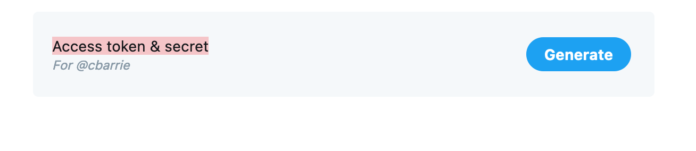

# Working with Digital Data

The lecture material for today mentioned work by @Freelon2018a, @Bruns2019, @Puschmann2019, and @Lazer2020b as well as a [report](https://www.disinfobservatory.org/download/26541) by SOMA outlining solutions for research data exchange. 

These example tasks use different sources of online data, and here I introduce you to how we might gather data through both screen-scraping (or server-side) techniques as well as API (or client-side) techniques. 

## Tutorial: APIs 

In this tutorial, you will learn how to:

* Get developer access credentials to Twitter
* Get Academic Research Product Track access credentials to Twitter
* Use the <tt>academictwitteR</tt> package to query the Twitter API

## Setup 

In order to use the Twitter Academic Research Product Track you will first need to obtain an authorization token. You will find details about the process of obtaining authorization [here](https://developer.twitter.com/en/solutions/academic-research/application-info). 

**In order to gain authorization you first need a Twitter account.**

First, Twitter will ask for details about your academic profile. Per the documentation linked above, they will ask for the following:

> Your full name as it is appears on your institution’s documentation
> 
>   Links to webpages that help establish your identity; provide one or more of the following:
> 
>   - A link to your profile in your institution’s faculty or student directory
>   - A link to your Google Scholar profile
>   - A link to your research group, lab or departmental website where you are listed
> 
>   Information about your academic institution: its name, country, state, and city
> 
>   Your department, school, or lab name
> 
>   Your academic field of study or discipline at this institution
> 
>   Your current role as an academic (whether you are a graduate student, doctoral candidate,       post-doc, professor, research scientist, or other faculty member)

Twitter will then ask for details of the proposed research project. Here, questions include:

> 1. What is the name of your research project?
>
> 2. Does this project receive funding from outside your academic institution? If yes, please list all your sources of funding.
>
> 3. In English, describe your research project. Minimum 200 characters.
>
> 4. In English, describe how Twitter data via the Twitter API will be used in your research project. Minimum 200 characters.
>
> 5. In English, describe your methodology for analyzing Twitter data, Tweets, and/or Twitter users. Minimum 200 characters.
>
> 6. Will your research present Twitter data individually or in aggregate?
>
> 7. In English, describe how you will share the outcomes of your research (include tools, data, and/or other resources you hope to build and share). Minimum 200 characters.
>
> 8. Will your analysis make Twitter content or derived information available to a government entity?

Once you have gained authorization for your project you will be able to see the new project on your Twitter developer portal. First click on the developer portal as below. 

{width=80%}


Here you will see your new project, and the name you gave it, appear on the left hand side. Once you have associated an App with this project, it will also appear below the name of the project. Here, I have several Apps authorized to query the basic API. I have one App, named "gencap", that is associated with my Academic Research Product Track project. 


{width=80%}


When you click on the project, you will first see how much of your monthly cap of 10m tweets you have spent. You will also see the App associated with your project below the monthly tweet cap usage information.


{width=80%}


By clicking on the Settings icons for the App, you will be taken through to the information about the App associated with the project. Here, you will see two options listed, for "Settings" and "Keys and Tokens."


{width=80%}


Beside the panel for Bearer Token, you will see an option to Regenerate the token. You can do this if you have not stored the information about the token and no longer have access to it. It is important to store information on the Bearer Token to avoid having to continually regenerate the Bearer Token information.


{width=80%}


Once you have the Bearer Token, you are ready to use `academictwitteR`!

##  Load data and packages 

Before proceeding, we'll load the remaining packages we will need for this tutorial.


```r
library(tidyverse) # loads dplyr, ggplot2, and others
library(academictwitteR) # to query the Academic Research Product Track Twitter v2 API endpoint in R
```

## The Twitter Academic Research Product Track

The Academic Research Product Track permits the user to access larger volumes of data, over a far longer time range, than was previously possible. From the Twitter [documentation](https://developer.twitter.com/en/solutions/academic-research/application-info):

> "The Academic Research product track includes full-archive search, as well as increased access and other v2 endpoints and functionality designed to get more precise and complete data for analyzing the public conversation, at no cost for qualifying researchers. Since the Academic Research track includes specialized, greater levels of access, it is reserved solely for non-commercial use".

The new "v2 endpoints" refer to the v2 API, introduced around the same time as the new Academic Research Product Track. Full details of the v2 endpoints are available [here](https://developer.twitter.com/en/docs/twitter-api/early-access).

In summary the Academic Research product track allows the authorized user:

1. Access to the full archive of (as-yet-undeleted) tweets published on Twitter
2. A higher monthly tweet cap (10m--or 20x what was previously possible with the standard v1.1 API)
3. Ability to access these data with more precise filters permitted by the v2 API


## Querying the Twitter API with `academictwitteR`

We begin by storing our access token with:


```r
bearer_token = "AAAAAAAAAAAAAAAAAAAAA_INSERT_YOUR_TOKEN_HERE"
```

The workhorse function of `academictwitteR` when it comes to collecting tweets containing a particular string or hashtag is `get_all_tweets()`.


```r
tweets <-
  get_all_tweets(
    "#BLM OR #BlackLivesMatter",
    "2020-01-01T00:00:00Z",
    "2020-01-05T00:00:00Z",
    bearer_token,
    file = "blmtweets"
  )
```

Here, we are collecting tweets containing one or both of two hashtags related to the Black Lives Matter movement over the period January 1, 2020 to January 5, 2020. 

## Storage conventions in `academictwitteR`

Given the sizeable increase in the volume of data potentially retrievable with the Academic Research Product Track, it is advisable that researchers establish clear storage conventions to mitigate data loss caused by e.g. the unplanned interruption of an API query.

We first draw your attention first to the `file` argument in the code for the API query above.

In the file path, the user can specify the name of a file to be stored with a ".rds" extension, which includes all of the tweet-level information collected for a given query.

Alternatively, the user can specify a `data_path` as follows:


```r
tweets <-
  get_all_tweets(
    "#BLM OR #BlackLivesMatter",
    "2020-01-01T00:00:00Z",
    "2020-01-05T00:00:00Z",
    bearer_token,
    data_path = "data/"
    bind_tweets = FALSE
  )
```

In the data path, the user can either specify a directory that already exists or name a new directory. In other words, if there is already a folder in your working directory called "data" then `get_all_tweets` will find it and store data there. If there is no such directory, then a directory named (here) "data" will be created in your working directory for the purposes of data storage.

The data is stored in this folder as a series of JSONs. Tweet-level data is stored as a series of JSONs beginning "data_"; User-level data is stored as a series of JSONs beginning "users_".

Note that the `get_all_tweets()` function always returns a data.frame object unless `data_path` is specified and `bind_tweets` is set to `FALSE`. When collecting large amounts of data, we recommend using the `data_path` option with `bind_tweets = FALSE`. This mitigates potential data loss in case the query is interrupted, and avoids system memory usage errors.

## Binding JSON files into data.frame objects

Users can then use the `bind_tweet_jsons` and `bind_user_jsons` convenience functions to bundle the JSONs into a data.frame object for analysis in R as such:


```r
tweets <- bind_tweet_jsons(data_path = "data/")
```


```r
users <- bind_user_jsons(data_path = "data/")
```

## Inspecting the data

Let's say, as an example, we queried the Twitter API with the following code:


```r
get_all_tweets(
  "#BLM OR #BlackLivesMatter",
  "2020-01-01T00:00:00Z",
  "2020-01-05T00:00:00Z",
  bearer_token,
  data_path = "data/academictwitteR_data",
  file = "data/blmtweets",
  bind_tweets = F
)
```

We can then look at the output in our directory of JSON files like this:


```r
list.files("data/academictwitteR_data")
```


```
##  [1] "data_1212161860600041475.json"  "data_1212202218138374144.json" 
##  [3] "data_1212454140183547909.json"  "data_1212541396005064704.json" 
##  [5] "data_1212602429998583808.json"  "data_1212745962499780610.json" 
##  [7] "data_1212848819668340737.json"  "data_1212931998357966848.json" 
##  [9] "data_1213102352925970433.json"  "data_1213244966530502656.json" 
## [11] "data_1213425494068285442.json"  "query"                         
## [13] "users_1212161860600041475.json" "users_1212202218138374144.json"
## [15] "users_1212454140183547909.json" "users_1212541396005064704.json"
## [17] "users_1212602429998583808.json" "users_1212745962499780610.json"
## [19] "users_1212848819668340737.json" "users_1212931998357966848.json"
## [21] "users_1213102352925970433.json" "users_1213244966530502656.json"
## [23] "users_1213425494068285442.json"
```

, which we can then bind as follows:


```r
blmtweets <- bind_tweet_jsons("data/academictwitteR_data")
```

Or we can simply read in the data already stored in serialized format as a .rds file:


```r
blmtweets <- readRDS("data/blmtweets.rds")
```

And we'll end up with something like this:

{width=100%}

## Building a query 

The v2 Twitter API allows for greater precision when making queries. A query might just be a single string like "happy new year" if you're interested on how people are celebrating on the night of December 31. Alternatively, the query might involve several additional operators that filter tweets with greater precision to return specific tweet content. 

The following section guides you through the logics underpinning queries to the Twitter API. For full information on these logics you may additionally wish to consult the Twitter API documentation on how to build a query [here](https://developer.twitter.com/en/docs/twitter-api/tweets/search/integrate/build-a-query).

As above, for a particular set of hashtags a call may look like:


```r
bearer_token <- "" # Insert bearer token

tweets <-
  get_all_tweets(
    "#BLM OR #BlackLivesMatter",
    "2020-01-01T00:00:00Z",
    "2020-01-05T00:00:00Z",
    bearer_token
  )
```

Alternatively, we can specify a character string comprising several elements. For example, we if we wanted to search multiple hashtags, we could specify a query as follows:


```r
bearer_token <- "" # Insert bearer token

htagquery <- c("#BLM", "#BlackLivesMatter", "#GeorgeFloyd")

tweets <-
  get_all_tweets(
    htagquery,
    "2020-01-01T00:00:00Z",
    "2020-01-05T00:00:00Z",
    bearer_token
  )
```

, which will achieve the same thing as typing out `OR` between our strings.  

Note that the "AND" operator is implicit when specifying more than one character string in the query. See [here](https://developer.twitter.com/en/docs/twitter-api/tweets/search/integrate/build-a-query) for information on building queries for search tweets. Thus, when searching for all elements of a character string, a call may look like:


```r
bearer_token <- "" # Insert bearer token

tweets <-
  get_all_tweets("apples oranges",
                 "2020-01-01T00:00:00Z",
                 "2020-01-05T00:00:00Z",
                 bearer_token)
```

, which will capture tweets containing *both* the words "apples" and "oranges." The same logic applies for hashtag queries.

## Building a query manually

With `academictwitteR` you have two main options when building a query. The first is to do it "manually" by following the documentation provided by Twitter (linked above) and pasting in the relevant operators to your query.

Here's how you might achieve this, using the `get_all_tweets()` function:


```r
tweets <-
  get_all_tweets(
    "#BLM OR #BlackLivesMatter",
    "2020-01-01T00:00:00Z",
    "2020-01-05T00:00:00Z",
    bearer_token,
    data_path = "data/"
    bind_tweets = FALSE
  )
```

We begin with the same query as used in examples above, which searches for tweets containing one or both of the specified hashtags relating to the Black Lives Matter movement. We may, however, want to be more precise with our query. Let's say we were only interested in tweets written in English and originating from the US. We would add several operators to our query to filter by these characteristics:


```r
tweets <-
  get_all_tweets(
    "#BLM OR #BlackLivesMatter place_country:US lang:en",
    "2020-01-01T00:00:00Z",
    "2020-01-05T00:00:00Z",
    bearer_token,
    data_path = "data/",
    bind_tweets = FALSE
  )
```

Let's further say that we weren't interested in retweets, and that we were only interested in tweets that contained an image. We would then narrow down our query further:


```r
tweets <-
  get_all_tweets(
    "#BLM OR #BlackLivesMatter place_country:US lang:en -is:retweet has:images",
    "2020-01-01T00:00:00Z",
    "2020-01-05T00:00:00Z",
    bearer_token,
    data_path = "data/",
    bind_tweets = FALSE
  )
```

We might then decide that our geo filter is not accurate enough. We don't just want tweets originating from the US but we want tweets from Seattle in particular. This would mean adding more operators to our query:


```r
tweets <-
  get_all_tweets(
    "#BLM OR #BlackLivesMatter place_country:US place:seattle lang:en -is:retweet has:images",
    "2020-01-01T00:00:00Z",
    "2020-01-05T00:00:00Z",
    bearer_token,
    data_path = "data/",
    bind_tweets = FALSE
  )
```

What if we were unsatisfied with the accuracy of our geo parameters and we wanted to be sure that our tweets were actually coming from a particular place? Let's say we are interested in central Seattle, as shown in the map below.

{width=70%}

Twitter also allows us to query tweets originating from within a particular geographical buffer too. Here, we simply specify the longitude and latitude of the southwest and then the northeast corners of this bounding box. Note, this image is taken from a screenshot of the website [http://bboxfinder.com](http://bboxfinder.com). Many such websites exist that allow you to find the bounding box coordinates of a place of interest, including [https://www.openstreetmap.org](https://www.openstreetmap.org) and [https://boundingbox.klokantech.com/](https://boundingbox.klokantech.com/).

We can then input this information with the "bounding_box" operator as below:


```r
tweets <-
  get_all_tweets(
    "#BLM OR #BlackLivesMatter bounding_box:[-122.375679 47.563554 -122.266159 47.643417] lang:en -is:retweet has:images",
    "2020-01-01T00:00:00Z",
    "2020-01-05T00:00:00Z",
    bearer_token,
    data_path = "data/",
    bind_tweets = FALSE
  )
```

## Building a query with `build_query()`

Alternatively, you can use the convenience function `build_query()` included in the `academictwitteR` package. 

The function comes with multiple optional parameters, which can be combined to generate a more precise query. This can then be passed to an object, here called "query," which can then be entered into the `get_all_tweets()` function as our query. Alternatively, the `build_query` arguments (with the exception of the `geo_query` argument) can be added as additional arguments into the `get_all_tweets` function. 

The below provides an example, and prints the out output of the function. Here, we are building a query for the #BLM hashtag, specifying that we do not want to capture retweets, that we want tweets to originate from London, that we don't want to capture any promoted tweets, that we want the tweets to contain  URLs, that we want it to contain videos, and that they are written in English. 


```r
query <- build_query(query = "#BLM", is_retweet = FALSE, place = "London", remove_promoted = TRUE, has_links = TRUE, has_videos = TRUE, lang = "en")

query
```

```
## [1] "#BLM -is:retweet place:London -is:nullcast has:links has:videos lang:en"
```

We can also enter geographical information with the `build_query()` function. Our two options here are the `point_radius` and `bbox` arguments. Both of these take numeric vectors as inputs. The `point_radius` argument requires three pieces of information: the longitude and latitude of a target coordinate, and the buffer size around that coordinate. The `bbox` argument, which stands for "bounding box," requires four pieces of information: the longitude and latitude of the southwest corner of the bounding box and the longitude and latitude of the northeast corner of the bounding box.

To build a query including a filter by point radius, we might use:


```r
query <-
  build_query(
    query = "#BLM",
    point_radius = c(-0.131969125179604, 51.50847878040284, 25)
  )

query
```

```
## [1] "#BLM point_radius:[-0.131969125179604 51.5084787804028 25mi]"
```

Note that the maximum radius for the buffer is 25 miles. Similarly, the maximum height and width of any bounding box is 25 miles. Inputting coordinate information that exceeds these bounds will result in a 400 status code error.

To make things a bit simpler, the `build_query()` function also includes prompts for entering parameters that require more precise geographical information, like the "bounding_box" or "point_radius" parameters for which we can submit queries to the Twitter API. These can be called by setting the `geo_query` argument to `TRUE` as so:


```r
query <- build_query(query = "#BLM", geo_query = TRUE)
```

```
Which geo buffer type type do you want? 

1: Point radius
2: Bounding box
```

If we select option 1, we will then be prompted to enter the longitude, latitude, and radius of the buffer emanating outwards from this coordinate as below, where I enter the same information as we did above:

```
Selection: 1
What is longitude? -0.131969125179604
What is latitude? 51.50847878040284
What is radius? 25

```


And we see that the end result is the same as the above:


```r
query
```

```
## [1] "#BLM -is:retweet point_radius:[-0.131969125179604 51.50847878040284 25mi]"
```

Note that `build_query()` can also take a character vector of strings as query. This will produce the equivalent of typing "OR" between our target strings. Let's say we were interested in multiple hashtags and not just one. We could still build a query to filter our tweets by the parameters discussed above as follows:


```r
htagquery <- c("#BLM", "#BlackLivesMatter", "#GeorgeFloyd")

query <-
  build_query(
    query = htagquery,
    is_retweet = FALSE,
    place = "London",
    remove_promoted = TRUE,
    has_links = TRUE,
    has_videos = TRUE,
    lang = "en"
  )

query
```

```
## [1] "(#BLM OR #BlackLivesMatter OR #GeorgeFloyd) -is:retweet place:London -is:nullcast has:links has:videos lang:en"
```

And if you wanted to just call `build_query()` within the `get_all_tweets()` function (rather than building it separately) you could do this too:


```r
tweets <-
  get_all_tweets(
    "#BLM OR #BlackLivesMatter",
    "2020-01-01T00:00:00Z",
    "2020-01-05T00:00:00Z",
    bearer_token,
    data_path = "data/",
    bind_tweets = FALSE,
    lang = "en",
    is_retweet = F,
    has_images = T
  )
```

, which would search for tweets containing the Black Lives Matter hashtags, in English, removing RTs, and containing images. Voilá!
